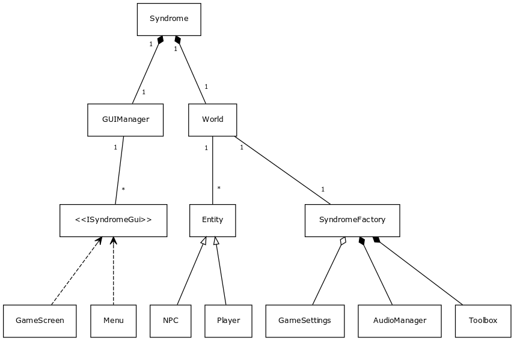
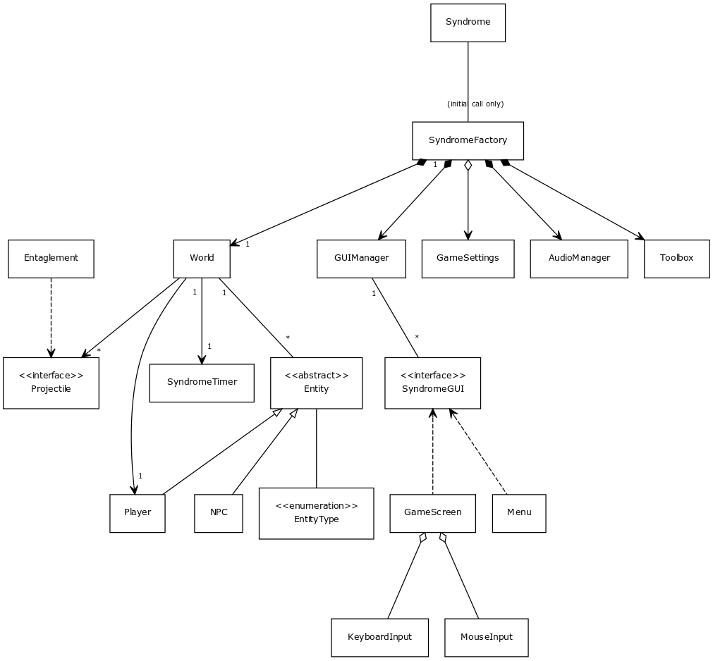
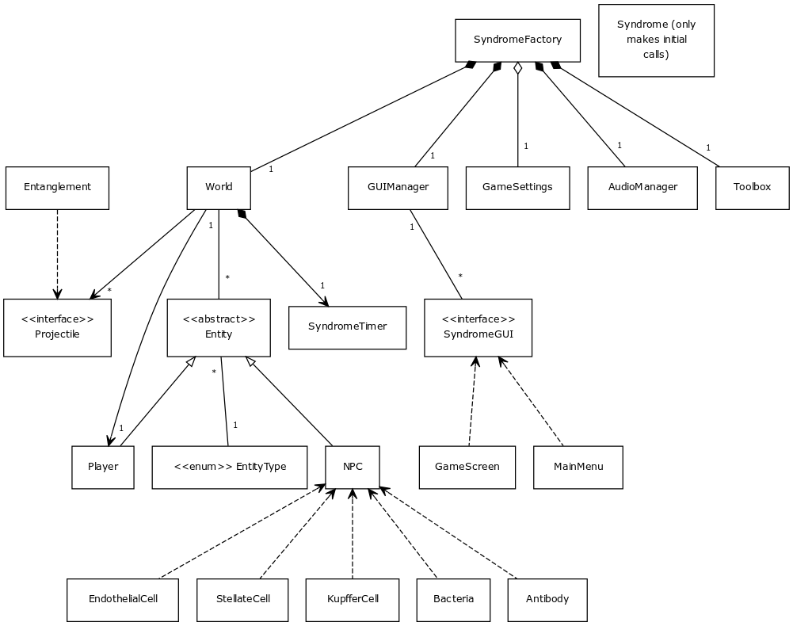
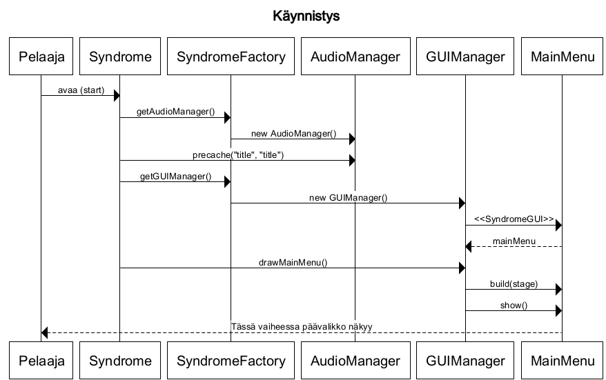
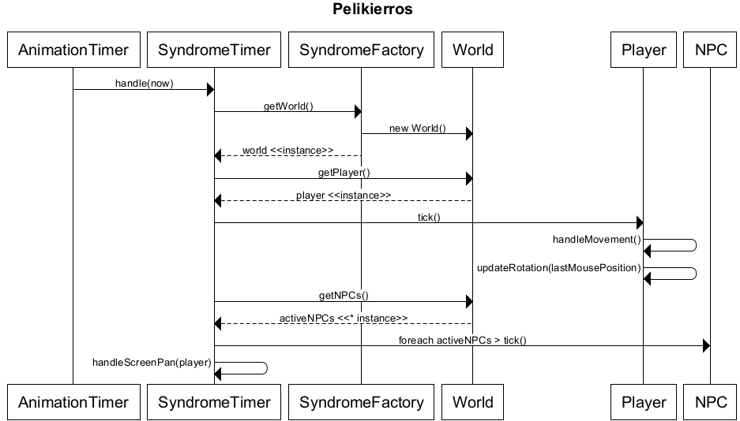

#Aihe

Jarmon syndroomassa pelaaja on virus ja objektiivi on tuhota maksan immuunipuolustusta. Solut ovat jossain määrin biologisesti tarkkoja.
Vasta-aineet ovat pahin vihollisesi. Hahmo kehittyy (ei tarinallisesti) ja tasot vaikeutuvat. Pelaajalla on mahdollisuus kehittää virustaan tasojen myötä (mm. triple-burst @ lvl 5).

Ideoita:
* Solun tuhoaminen.
* Mutaatiot, virusten nopea tapa muuttua.
* Virukselle ominainen taso, joka pelin myötä progressiivinen. Tuo mukanaan tehokkaampia tapoja levitä.
* Peli sijoittuu siis ihmisen sisälle ideana integroida "pelilaudan" kunto ja toiminnat vaikuttaviksi voimiksi.
* 19.2: idea vaihtuu hieman.
* * Ollaankin maksassa, ja vastassa on Kupfferin soluja, epiteelisoluja ja muita mukavuuksia.
* * Idea on piirtopyödällä, mutta <b>entity.impl</b> paketin dokumentaatioissa on jotain tietoja.

#Käyttäjät

<b>Pelaaja</b>
  * Ohjaa virusta
  * Valitsee aloittaa pelin
  * Valitsee, mitä soluja tuhoaa missäkin järjestyksessä
   * Järjestys vaikuttaa aina seuraavaan tasoon.
  * Vaikuttaa pelaamisellaan tulevaisuuteensa
   * esim. tuhoamalla T-soluja tasossa n johtaa vähempään määrään T-soluja tasossa n+1.
  * Määrittää peliasetukset

#Määrittelyvaiheen luokkakaavio

<h2> 1.0 (22.1.) </h2> 

<h2> 2.0 (5.2.) </h2>

<h2> 3.0 (19.2) </h2>

#Sekvenssikaavioita

<h2> Käynnistysvaihe eli päävalikon piirtäminen </h2>

<h2> Yhden pelikierroksen kuvaus </h2>

